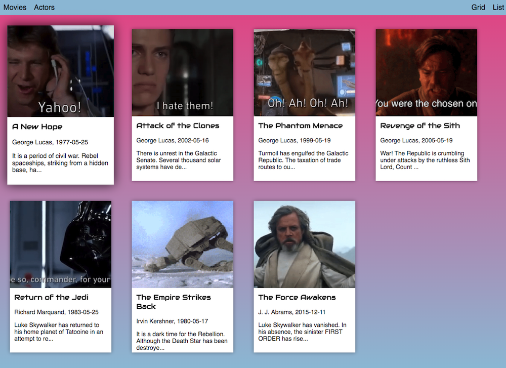

# Vue Workshop

Finished files for [the PRG06 Vue workshop](https://github.com/HR-CMGT/vue-workshop)



## Using

Follow the [install guide for Typescript, Webpack and Vue here](https://github.com/HR-CMGT/vue-workshop/blob/master/presentation/install.md).

```
git clone https://github.com/HR-CMGT/vue-workshop-finished.git
npm install
code .
webpack --watch
```

## Reading List

- [Vue documentation: Introduction](https://vuejs.org/v2/guide/index.html)
- [5 practical examples for learning Vue.js](https://tutorialzine.com/2016/03/5-practical-examples-for-learning-vue-js)
- [Vue documentation: Single File Components](https://vuejs.org/v2/guide/single-file-components.html)
- [CSS Tricks: introduction to Vue](https://css-tricks.com/intro-to-vue-1-rendering-directives-events/)
- [Typescript Class Components tutorial](https://alligator.io/vuejs/typescript-class-components/)
- [Vue Class Component on github](https://github.com/vuejs/vue-class-component)
- [Vue documentation: typescript support](https://vuejs.org/v2/guide/typescript.html)
- [Using Vue components without Webpack](https://vuejsdevelopers.com/2017/09/24/vue-js-single-file-javascript-components/)
- [Microsoft Typescript Vue Starter](https://github.com/Microsoft/TypeScript-Vue-Starter)
- [Previous Typescript examples HR CMGT](https://github.com/HR-CMGT/Typescript)
- [Using Headers with Fetch](https://developer.mozilla.org/en-US/docs/Web/API/Fetch_API/Using_Fetch)
- [Using Promises](https://davidwalsh.name/promises)
- [Using Async Await](https://developer.mozilla.org/en-US/docs/Web/JavaScript/Reference/Statements/async_function)
- [Binding Styles in Vue](https://vuejs.org/v2/guide/class-and-style.html)